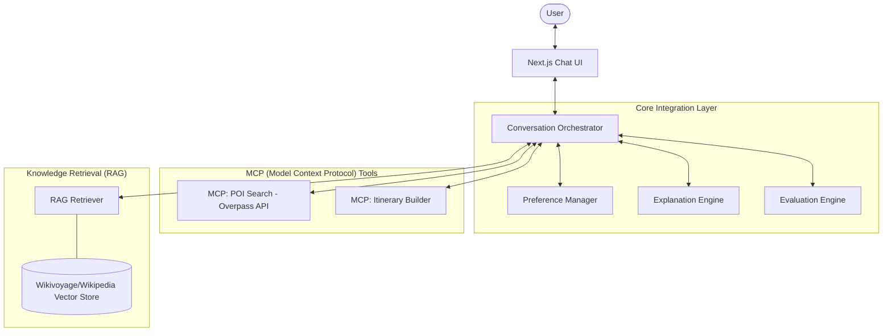

# Detailed Architecture: RAG-Grounded Travel Voice Assistant

## 1. System Philosophy
The system is built on the principle of **Grounded Generation**. Unlike standard LLM chat bots, this system separates the *creative* aspect (Chat UI) from the *factual* aspect (MCP Tools & RAG). 

- **Factual Integrity**: Every Point of Interest (POI) must correspond to an OpenStreetMap (OSM) ID.
- **Feasibility**: Itineraries are built using deterministic constraints (travel time, opening hours, pace).
- **Justification**: Every recommendation is backed by a specific citation from Wikivoyage/Wikipedia.

---

## 2. High-Level Architecture


---

## 3. Component Deep Dive

### 3.1 Conversation Orchestrator (Stateful)
- **Engine**: GPT-4o with Function Calling.
- **Role**: Routes user messages, detects intents (Planning vs. Editing vs. Questioning), and manages the 6-turn clarification limit.
- **State Schema**:
  ```json
  {
    "session_id": "uuid",
    "status": "collecting_preferences | confirmed | generating | idle",
    "clarification_count": 0,
    "current_itinerary_version": "v1"
  }
  ```

### 3.2 Preference Manager
- **Validator**: Ensures inputs match the allowed scope (Cities: Jaipur, Goa, Bengaluru; Days: 1-3).
- **Schema**:
  ```typescript
  interface TripPreferences {
    city: 'Jaipur' | 'Bengaluru' | 'Goa';
    trip_days: 1 | 2 | 3;
    pace: 'relaxed' | 'balanced' | 'packed';
    interests: string[];
    constraints: {
      avoid_long_travel: boolean;
      indoor_preferred: boolean;
    };
  }
  ```

### 3.3 MCP Tools (External Data)
#### A. POI Search Tool
- **Input**: City, Tags (mapped from interests).
- **Action**: Generates an Overpass QL query (e.g., `node["tourism"="museum"](area)`) to fetch real coordinates and OSM metadata.
- **Benefit**: Zero hallucinations. If OSM doesn't have it, the tool doesn't return it.

#### B. Itinerary Builder Tool
- **Heuristic**: Uses a greedy TSP (Traveling Salesperson) approximation to group POIs by geographic proximity.
- **Constraints**: 
  - Relaxed: 3 POIs/day (~2 hrs per stop).
  - Balanced: 4 POIs/day.
  - Packed: 5 POIs/day.

### 3.4 RAG Pipeline (Retriever & Explanation)
- **Data Source**: Markdown files parsed from Wikivoyage.
- **Logic**: When a POI is chosen, the Retriever fetches the "See", "Eat", or "Do" section for that area.
- **Explanation**: "I chose City Palace because [Source: Wikivoyage] it is the central landmark of the Pink City."

### 3.5 Evaluation Engine (Automated)
Every generated itinerary is passed through a validation pipeline:
1.  **Feasibility Check**: (Total Duration + Travel Time) <= 10 hours.
2.  **Edit Correctness**: If the user asked to "Change Day 2," the Engine calculates the diff between `v1` and `v2`. If Day 1 or Day 3 changed, the eval fails.
3.  **Grounding Check**: Verifies all `poi_id`s exist in the OSM result set.

---

## 4. Technical Stack
| Layer | Technology |
| :--- | :--- |
| **Frontend** | Next.js 14 (App Router), Tailwind CSS, Framer Motion (for voice animations) |
| **Backend** | Next.js API Routes (node js)|
| **LLM** | Groq (State Management), Gemini (RAG) |
| **Database** | Local JSON for prototype |
| **Vector Store** | LangChain / chromadb (Local) |
| **APIs** | Overpass API (OSM), Google maps Places API for nearby places search |

---

## 5. Directory Structure
```text
/src
  /app                # UI Layout & Chat Page
  /components
    /chat             # Voice/Text Input, Message History
    /itinerary        # Day-wise visual cards & Maps
    /sources          # Citation side-panel
  /lib
    /mcp              # POI & Itinerary Tool logic
    /rag              # Retrieval & Vector store logic
    /orchestrator     # LLM system prompts & state logic
    /eval             # Rule-based evaluation scripts
  /types              # TypeScript interfaces
/data                 # Scraped Wikivoyage markdown files
```

---

## 6. Sequence Diagram (Planning Flow)
1. **User**: "Plan a trip to Jaipur."
2. **Orc**: Detects missing `interests` and `pace`.
3. **Orc** -> **User**: "What do you like? Culture/Food? And what pace?"
4. **User**: "Culture, relaxed."
5. **Orc** -> **PM**: Validates and Saves.
6. **Orc** -> **POI Tool**: Fetch culture POIs in Jaipur.
7. **Orc** -> **IB Tool**: Build 2-day relaxed itinerary.
8. **Orc** -> **EE**: Generate explanations with Wikivoyage citations.
9. **UI**: Renders the final Plan.
